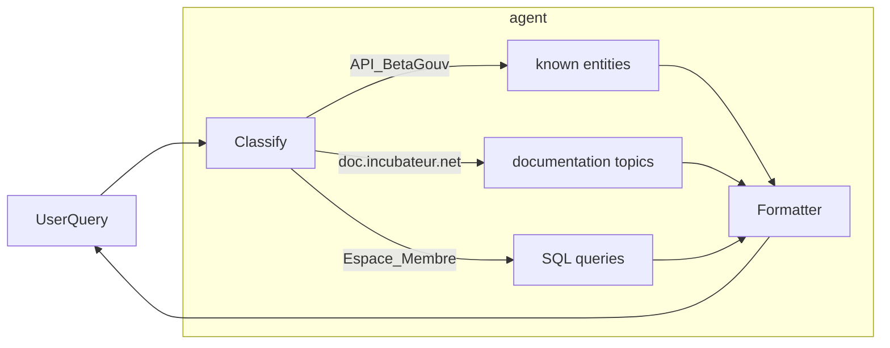
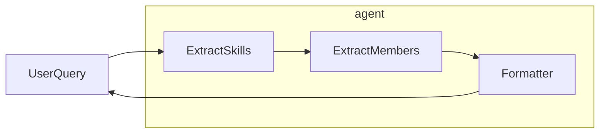

# mastra-beta

Agent IA au service de la communauté

## beta-agent

### beta-workflows



### skills-workflows



## Scope

- [x] queries about community members and startups
- [x] queries about documentation
- [ ] queries about code
- [ ] queries about news (members, products, community updates)

## Dev

Create a `.env` from example

```sh
npm i
# setup data

# vectorize documentation
npm run create-doc-store

# create espace-membre PostgreSQL view
psql $ESPACE_MEMBRE_DATABASE_URL < create-views.sql

npm run dev
```

## Todo

- improve initial routing
- sql query transparency (explain to the user)
- handle multi NER queries: "whats the diff in X and Y"
- cron to update datas (documentation + fiches)
- MCP
- data:
  - publiccode: https://github.com/suitenumerique/docs/blob/main/publiccode.yml
  - incubator & teams
  - calendar
  - données tech (stack, apis)
  - changelogs
  - https://betagouv.github.io/beta.gouv.fr/startups.html

### Idées

- Bot qui ajoute des publiccode.yaml dans les repos
- Bot pour trouver des pairs

### Data maintenance

- update documentation
- update database views
